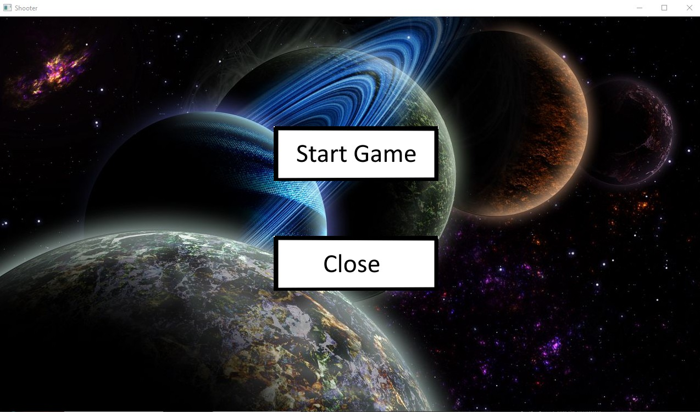
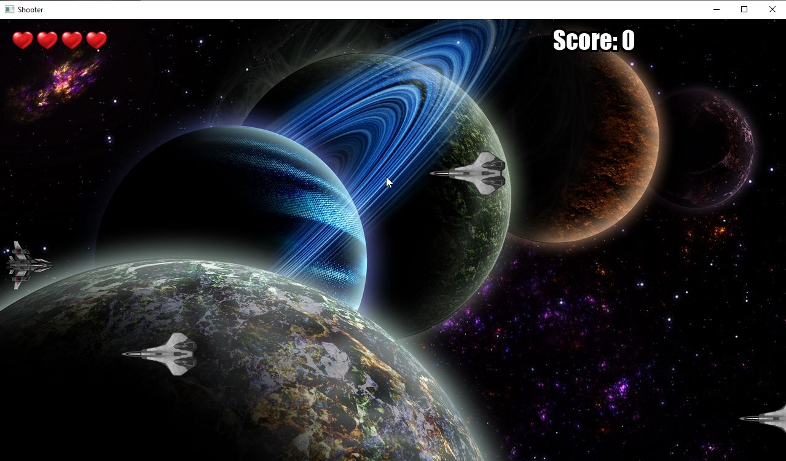
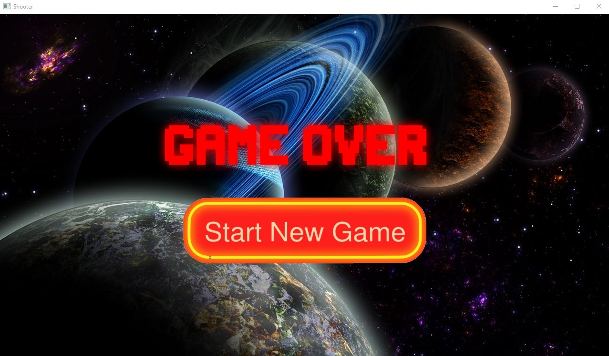

# Shooter

Игра Shooter, написанная на С++ с использованием библиотеки SFML.

Меню


Игра


Game Over


# Управление

Меню

- Нажмите кнопку Start Game, чтобы запуститься игру.
- Нажмите кнопку Close, чтобы выйти.

Игра

- Нажмите и удерживайте клавишу W для перемещения вверх.
- Нажмите и удерживайте клавишу S для перемещения вниз.
- Нажмите клавишу Space, чтобы выстрелить.
- Нажмите клавишу Tab для выхода в меню.
- Стреляйте по движущимся целям. Если противник достигнет левой границы, количество здоровья уменьшится.
- По окончании здоровья появится окно Game Over.

Game Over
- Нажмите кнопку Start New Game для перезапуска игры.
- Нажмите клавишу Tab для выхода в меню.

# Требования
1. Скачать и установить vcpkg:
```markdown
git clone https://github.com/microsoft/vcpkg.git
cd vcpkg
bootstrap-vcpkg.bat
vcpkg integrate install
```

3. Скачать и установить CMake

4. Скачать SFML:
```markdown
vcpkg install sfml
```

6. Клонировать репозиторий:
```markdown
git clone https://github.com/nKadykov/shooter_project.git
```

8. Создать папку с проектом:
```markdown
mkdir build
cd build
```

10. Собрать проект:
```markdown
cmake .. -DCMAKE_TOOLCHAIN_FILE=C:/path/to/vcpkg/scripts/buildsystems/vcpkg.cmake
```
Заменить C:/path/to/vcpkg на путь к vcpkg
```markdown
cmake --build
```
